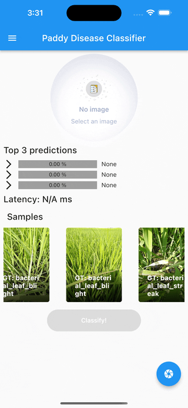

### 🔥 Motivation
- Brief overview of computer vision and its importance in mobile applications
- The challenge of bringing high-quality image models to mobile devices
- The goal of the article and a preview of what will be covered

Hurdles in mobile computer vision -

+ Limited hardware resources: Mobile devices have limited hardware resources compared to desktop computers or cloud servers. This means that the computational power available on mobile devices may not be enough to run complex computer vision models.

+ Limited memory: Mobile devices also have limited memory, which can make it difficult to store and retrieve large amounts of data required for computer vision models.

+ Battery life: Running complex computer vision models on mobile devices can consume a lot of battery power, which can significantly reduce the battery life of the device.

+ Processing speed: Mobile devices typically have slower processing speeds than desktop computers or cloud servers. This can make it difficult to process large amounts of data required for computer vision models in real-time.

+ Optimization: In order to run computer vision models efficiently on mobile devices, they need to be optimized for the specific hardware and software environment of the device. This requires specialized knowledge and expertise in both computer vision and mobile development.

+ Deployment: Finally, deploying computer vision models on mobile devices requires careful consideration of factors such as app size, download times, and compatibility with different operating systems and devices.

Demo on iOS iPhone 14 Pro

### HuggingFace x TIMM

- Introducing HuggingFace and TIMM as a solution
- Introduction to the TIMM (Timm Image Models) library and its architecture
- Advantages of using HuggingFace TIMM for mobile computer vision applications
- Introduction to the HuggingFace Model Hub and its collection of pretrained models
- Explanation of how to use pretrained models with HuggingFace TIMM for mobile computer vision applications
- Comparison of the performance of pretrained models with custom models on mobile devices
- Advantages and disadvantages of using pretrained models

### REST API
- Rest API with Gradio.

### Flutter
- Build user interface.
- Don't want to get user lost in the detail implementation. Refer to GitHub repo.

### Conclusion and Future of Mobile Computer Vision

- Summary of the importance of high-quality image models for mobile applications
- Recap of HuggingFace TIMM's role in bringing these models to mobile devices
- Discussion of future possibilities for mobile computer vision using HuggingFace TIMM and other emerging technologies

## **FAQs**
- What is computer vision, and why is it important for mobile applications?
- What is HuggingFace, and how does it relate to computer vision?
- What is the TIMM library, and what makes it unique compared to other computer vision libraries?
- What are the limitations of Android and iOS for computer vision applications?
- What is the Android Neural Networks API (NNAPI), and how does it work with HuggingFace TIMM?
- What is the Core ML framework, and how does it work with HuggingFace TIMM?
- What are pretrained models, and why are they important in computer vision?
- How do I use pretrained models with HuggingFace TIMM for mobile computer vision applications?
- How does the performance of pretrained models compare to custom models on mobile devices?
- What are the advantages and disadvantages of using pretrained models for mobile computer vision applications?