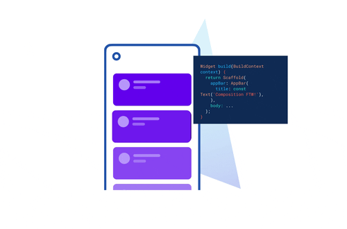

### 🔥 Motivation
<!-- You finally got into a Kaggle competition. You found a *getting-started notebook* written by a Kaggle Grandmaster and immediately trained a state-of-the-art (SOTA) image classification model.

After some fiddling, you found yourself in the leaderboard topping the charts with **99.9851247\% accuracy** on the test set 😎!

Proud of your achievement you reward yourself to some rest and a good night's sleep. 
And tomorrow it's time to move on to the next dataset (again). -->

<!-- And then..

 -->

<!-- I hope this doesn't keep you awake at night as it did for me. -->

With various high-level libraries like [Keras](https://keras.io/), [Transformer](https://huggingface.co/docs/transformers/index), and [Fastai](https://www.fast.ai/), the barrier to training SOTA models has never been lower.

On top of that with platforms like [Google Colab](https://colab.research.google.com/) and [Kaggle](https://www.kaggle.com/), pretty much anyone can train a reasonably good model using an old laptop or even a mobile phone (with some patience).

{}
The question is no longer "**can we train a SOTA model?**", but "**what happens after that?**"
{}

Unfortunately, after getting the model trained, most people wash their hands off at this point claiming their model works. 
But, what good would SOTA models do if it's just in notebooks and Kaggle leaderboards?

{}
Unless the model is deployed and put to use, it's of little benefit to anyone out there.
{}



But deployment is painful. Running a model on a mobile phone? 

Forget it 🤷‍♂️.

The frustration is real. I remember spending nights exporting models into `ONNX` and it still failed me.

Deploying models on mobile for edge inference used to be complex. 

Not anymore.

In this post, I'm going to show you how you can pick from over 900+ SOTA models on [TIMM](https://github.com/rwightman/pytorch-image-models), train them with best practices with [Fastai](https://www.fast.ai/2020/02/13/fastai-A-Layered-API-for-Deep-Learning/), and deploy them on Android using [Flutter](https://flutter.dev/). 

✅ Yes, for free.


⚡ By the end of this post you will learn how to:
+ Load a SOTA classification model from TIMM and train it with Fastai.
+ Export the trained model into TorchScript for inference.
+ Create a functional Android app and run the model inference on your device.

💡 **NOTE**: Code and data for this post are available on my GitHub repo [here](https://github.com/dnth/timm-flutter-pytorch-lite-blogpost).


Demo of the app 👇


<!-- You might wonder, do I need to learn ONNX? TensorRT? TFLite?

Maybe.

Learning each one of them takes time. Personally, I never had a very positive experience with exporting PyTorch models into ONNX.
It doesn't work every time. -->
<!-- I had to pull my hair over sleepless nights exporting to ONNX.
They are out of the PyTorch ecosystem. -->

<!-- But in this post, I will show you a solution that holds the best chance of working - TorchScript. -->
<!-- Integrated within the PyTorch ecosystem. -->

If that looks interesting, read on 👇

### 🌿 Dataset
We will be working with the Paddy Disease Classification [dataset](https://www.kaggle.com/competitions/paddy-disease-classification) from Kaggle. 

The dataset consists of `10,407` labeled images across ten classes (9 diseases and 1 normal):
1. `bacterial_leaf_blight`
2. `bacterial_leaf_streak`
3. `bacterial_panicle_blight`
4. `blast`
5. `brown_spot`
6. `dead_heart`
7. `downy_mildew`
8. `hispa`
9. `tungro`
10. `normal`

The task is to classify the paddy images into `1` of the `9` diseases or `normal`. 

Here's what the images look like.


Next, I download the data locally and organize them in a folder structure. 
Here's the structure I have on my computer.
```tree
├── data
│   ├── test_images
│   └── train_images
│       ├── bacterial_leaf_blight 
│       ├── bacterial_leaf_streak 
│       ├── bacterial_panicle_blight 
│       ├── blast 
│       ├── brown_spot 
│       ├── dead_heart 
│       ├── downy_mildew 
│       ├── hispa 
│       ├── models
│       ├── normal 
│       └── tungro 
└── train
    └── train.ipynb
```

Descriptions of the folders:
+ `data/` - A folder to store train and test images.
+ `train/` - A folder to store training-related files and notebooks.

View the full structure by browsing my GitHub [repo](https://github.com/dnth/timm-flutter-pytorch-lite-blogpost).



If you'd like to explore the dataset and excel in the competition, I'd encourage you to check out a series of Kaggle notebooks by Jeremy Howard.
+ [First Steps.](https://www.kaggle.com/code/jhoward/first-steps-road-to-the-top-part-1)
+ [Small Models.](https://www.kaggle.com/code/jhoward/small-models-road-to-the-top-part-2)
+ [Scaling Up.](https://www.kaggle.com/code/jhoward/scaling-up-road-to-the-top-part-3)
+ [Multi-target.](https://www.kaggle.com/code/jhoward/multi-target-road-to-the-top-part-4)

I've personally learned a lot from the notebooks. Part of the codes in the post is adapted from the notebooks.


Now that we've got the data, let's see how to start building a model out of it

For that we need 👇

### 🥇 PyTorch Image Models
There are many libraries to model computer vision tasks but PyTorch Image Models or [TIMM](https://github.com/rwightman/pytorch-image-models) by [Ross Wightman](https://www.linkedin.com/in/wightmanr/) is arguably the most prominent one today.

The TIMM repository hosts hundreds of recent SOTA models maintained by Ross.
At this point (January 2023) we have 964 pre-trained models on TIMM and increasing as we speak.

You can install TIMM by simply:
```bash
pip install timm
```

One line of code, and we'd have access to all models on TIMM!

With such a massive collection, it can be disorienting which model to start from.
Worry not, TIMM provides a function to search for model architectures with a [wildcard](https://www.delftstack.com/howto/python/python-wildcard/).

Since we will be running the model on a mobile device, let's search for models that have the word *edge* with:

```python
import timm
timm.list_models('*edge*')
```

This outputs all models that match the wildcard.
```bash
['cs3edgenet_x',
 'cs3se_edgenet_x',
 'edgenext_base',
 'edgenext_small',
 'edgenext_small_rw',
 'edgenext_x_small',
 'edgenext_xx_small']
```
Looks like we have something related to the EdgeNeXt model. 

With a simple search and reading through the preprint [EdgeNeXt - Efficiently Amalgamated CNN-Transformer Architecture for Mobile Vision Applications](https://arxiv.org/abs/2206.10589), looks like it's a fitting model for our application!

With the model name, you can now start training.
The TIMM repo provides various utility functions and training scripts. Feel free to use them.

In this post, I'm going to show you an easy way to train a TIMM model using Fastai 👇


### 🏋️‍♀️ Training with Fastai
[Fastai](https://www.fast.ai/2020/02/13/fastai-A-Layered-API-for-Deep-Learning/) is a deep learning library that provides practitioners with high high-level components that can quickly provide SOTA results.
Under the hood Fastai uses PyTorch but it abstracts away the details and incorporates various best practices in training a model.

Install Fastai with:
```bash
pip install fastai
```

Since, we'd run our model on a mobile device, let's select the smallest model we got from the previous section - `edgenext_xx_small`.

Let's import all the necessary packages with:
```python
from fastai.vision.all import *
```

Next, load the images into a `DataLoader`.

```python
trn_path = Path('../data/train_images')
dls = ImageDataLoaders.from_folder(trn_path, seed=316, 
                                   valid_pct=0.2, bs=128,
                                   item_tfms=[Resize((224, 224))], 
                                   batch_tfms=aug_transforms(min_scale=0.75))
```

 

Parameters for the `from_folder` method:

* `trn_path` -- A `Path` to the training images.
* `valid_pct` -- The percentage of dataset to allocate as the validation set.
* `bs` -- Batch size to use during training.
* `item_tfms` -- Transformation applied to each item.
* `batch_tfms` -- Random transformations applied to each batch to augment the dataset. Read more [here](https://docs.fast.ai/vision.augment.html#aug_transforms).

📝 **NOTE**: Check out the Fastai [docs](https://docs.fast.ai/) for more information on the parameters.




You can show a batch of the train images loaded into the `DataLoader` with:

```python
dls.train.show_batch(max_n=8, nrows=2)
```



Next create a `Learner` object which stores the model, dataloaders, and loss function to train a model. 
Read more about the `Learner` [here](https://docs.fast.ai/learner.html#learner).

For vision classification tasks we can create a `Learner` by calling the `vision_learner` function and providing the necessary parameters:

```python
learn = vision_learner(dls, 'edgenext_xx_small', metrics=accuracy).to_fp16()
```

 
Parameters for `vision_learner`:
+ **dls** - The `Dataloader` object.
+ **edgenext_xx_small** - Model name from TIMM.

📝 **NOTE**: Read more on vision_learner [here](https://docs.fast.ai/vision.learner.html#vision_learner).

In Fastai, you can easily incorporate [Mixed Precision Training](https://on-demand.gputechconf.com/gtc/2019/video/_/S9143/) by adding the `.to_fp16()` method. This little trick reduces memory usage and trains your model faster at the cost of precision.


One of my favorite features in Fastai is the learning rate finder. 
It lets you estimate the range of learning rate to train the model for the best results.

Find the best learning rate with:

```python
learn.lr_find()
```



 

The orange dot 🟠 shows the suggested learning rate which is approximately at `2e-3`.

A good learning rate lies at the point where the loss is **decreasing most rapidly**. On the plot, it's anywhere 
from the orange dot 🟠 to the point where the loss starts increasing again approximately at `1e-1`. I'll pick `1e-2` as my learning rate.

Read a post by Zach Mueller on [how to pick a good learning rate](https://walkwithfastai.com/lr_finder).




Now train the model for 5 `epochs` and a base learning rate of `0.002` with the [1cycle policy](https://arxiv.org/pdf/1803.09820.pdf).
The `ShowGraphCallback` callback plots the progress of the training.

```python
learn.fine_tune(5, base_lr=1e-2, cbs=[ShowGraphCallback()])
```



With just a few lines of code, we can train a reasonably good model with Fastai. 
For completeness, here are the few lines of codes you need to load and train the model:

```python {linenos=table}
from fastai.vision.all import *
trn_path = Path('../data/train_images')
dls = ImageDataLoaders.from_folder(trn_path, seed=316,
                                  valid_pct=0.2, bs=128,
                                  item_tfms=[Resize((224, 224))], 
                                  batch_tfms=aug_transforms(min_scale=0.75))
learn = vision_learner(dls, 'edgenext_xx_small', metrics=accuracy).to_fp16()
learn.fine_tune(5, base_lr=1e-2, cbs=[ShowGraphCallback()])

```

&nbsp;


For demonstration purposes, I've only with only 5 `epochs`. You can train for longer to obtain better accuracy and model performance. 

📝 **NOTE**: View my training notebook [here](https://github.com/dnth/timm-flutter-pytorch-lite-blogpost/blob/main/train/train.ipynb).


You can optionally export the `Learner` object and import it from another script or notebook with:
```python
learn.export("../../train/export.pkl")
```

Once done, now it's time we transform the model into a form we can use for mobile inference.

For that, we'll need 👇

### 📀 Exporting to TorchScript
In this section, we export the model in a form suitable for a mobile device.
We can do that easily with [TorchScript](https://pytorch.org/docs/stable/jit.html).

{}

TorchScript is a way to create serializable and optimizable models from PyTorch code on 
a variety of platforms, including desktop and mobile devices, without requiring a Python runtime. 
{} 

With TorchScript, the model's code is converted into a static graph that can be optimized for faster performance, and then saved and loaded as a serialized representation of the model. 

This allows for deployment to a variety of platforms and acceleration with hardware such as GPUs, TPUs, and mobile devices.

<!-- {}
TorchScript is a way to create serializable and optimizable models from PyTorch code.
{} -->

All the models on TIMM can be exported to TorchScript with the following code snippet.

```python {linenos=table}
import torch
from torch.utils.mobile_optimizer import optimize_for_mobile

learn.model.cpu()
learn.model.eval()
example = torch.rand(1, 3, 224, 224)
traced_script_module = torch.jit.trace(learn.model, example)
optimized_traced_model = optimize_for_mobile(traced_script_module)
optimized_traced_model._save_for_lite_interpreter("torchscript_edgenext_xx_small.pt")
```

&nbsp;


From the snippet above we need to specify a few things:
+ `Line 6`: The shape of the input image tensor.
+ `Line 9`: "torchscript_edgenext_xx_small.pt" is the name of the resulting TorchScript serialized model.

📝 **NOTE**: View the full notebook from training to exporting the model on my GitHub repo [here](https://github.com/dnth/timm-flutter-pytorch-lite-blogpost/blob/main/train/train.ipynb).



Once completed, you'll have a file `torchscript_edgenext_xx_small.pt` that can be ported to other devices for inference.
In this post, I will be porting it to Android using a framework known as [Flutter](https://flutter.dev/). 

### 📲 Inference in Flutter


{}
Flutter is an open-source framework by Google for building beautiful, natively compiled, multi-platform applications from a single codebase.
{} 

We can load the `torchscript_edgenext_xx_small.pt` and use if for inference.
To do so, we will use the [pytorch_lite](https://github.com/zezo357/pytorch_lite) Flutter package.
The `pytorch_lite` package supports image classification and detection with TorchScript.

The following code snippet shows a function to load our serialized model `torchscript_edgenext_xx_small.pt`.

```dart {linenos=table}
Future loadModel() async {
    String pathImageModel = "assets/models/torchscript_edgenext_xx_small.pt";
    try {
        _imageModel = await PytorchLite.loadClassificationModel(
            pathImageModel, 224, 224,
            labelPath: "assets/labels/label_classification_paddy.txt");
    } on PlatformException {
        print("only supported for Android");
    }
}
```

&nbsp;


From the snippet above we need to specify a few things:
+ `Line 2`: Path to the serialized model.
+ `Line 5`: The input image size - `224` by `224` pixels.
+ `Line 6`: A text file with labels associated with each class.

View the full code on my GitHub [repo](https://github.com/dnth/timm-flutter-pytorch-lite-blogpost/blob/main/flutter_app/lib/main.dart).




The following code snippet shows a function to run the inference.
```dart {linenos=table}
Future runClassification() async {
    objDetect = [];
    //pick a random image
    final PickedFile? image =
        await _picker.getImage(source: ImageSource.gallery);

    //get prediction
    _imagePrediction = await _imageModel!
        .getImagePrediction(await File(image!.path).readAsBytes());

    List<double?>? predictionList = await _imageModel!.getImagePredictionList(
      await File(image.path).readAsBytes(),
    );

    List<double?>? predictionListProbabilites =
        await _imageModel!.getImagePredictionListProbabilities(
      await File(image.path).readAsBytes(),
    );

    //Gettting the highest Probability
    double maxScoreProbability = double.negativeInfinity;
    double sumOfProbabilites = 0;
    int index = 0;
    for (int i = 0; i < predictionListProbabilites!.length; i++) {
      if (predictionListProbabilites[i]! > maxScoreProbability) {
        maxScoreProbability = predictionListProbabilites[i]!;
        sumOfProbabilites = sumOfProbabilites + predictionListProbabilites[i]!;
        index = i;
      }
    }
    _predictionConfidence = (maxScoreProbability * 100).toStringAsFixed(2);

  }
```
Those are the two important functions to load and run the TorchScript model.

The following screen capture shows the Flutter app in action. 
The clip runs in real-time and is **NOT sped up**! 



The compiled `.apk` file is about **77MB** in size.

Try it out and install the pre-built `.apk` file on your Android phone [here](https://github.com/dnth/timm-flutter-pytorch-lite-blogpost/blob/main/app-release.apk?raw=true).

### 🙏 Comments & Feedback
That's a wrap! In this post, I've shown you how you can start from a model, train it, and deploy it on a mobile device for edge inference.


⚡ In short we learned how to:
+ Load a SOTA classification model from TIMM and train it with Fastai.
+ Export the trained model into TorchScript for inference.
+ Create a functional Android app and run the model inference on your device.

📝 **NOTE**: View the codes for the entire post on my GitHub repo [here](https://github.com/dnth/timm-flutter-pytorch-lite-blogpost/).


I hope you've learned a thing or two from this blog post.
If you have any questions, comments, or feedback, please leave them on the following Twitter/LinkedIn post or [drop me a message](https://dicksonneoh.com/contact/).
<!-- 


<iframe src="https://www.linkedin.com/embed/feed/update/urn:li:share:6940225157286264834" height="2406" width="550" frameborder="0" allowfullscreen="" title="Embedded post"></iframe> -->

